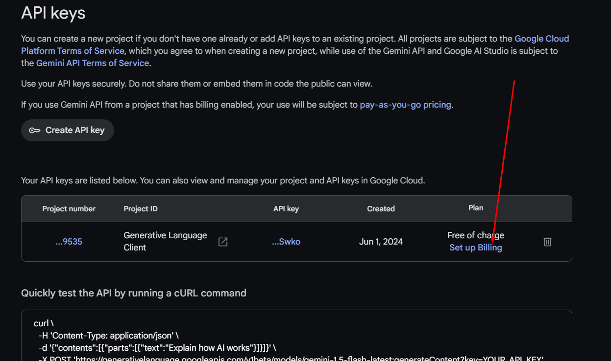

# Gemini ChatBot with WhatsApp using Whatabot API - Python

#### A simple project showing how to use the Gemini API with WhatsApp using [https://whatabot.io](https://whatabot.io) as a message broker

## Requirements

1. Python 3 installed
2. Gemini API Key: See below
3. Whatabot API Key: See below

## Installing requirements

```shell
pip install -r requirements.txt
```

## Getting Gemini API Key

1. Visit [https://aistudio.google.com/](https://aistudio.google.com/)
2. Get API key
3. Create API key
4. Create API key in new project (If you have an existent one you can select it in the box below)
5. Copy the API key and paste in the main.py GEMINI_API_KEY variable

### **IMPORTANT: In some countries, google needs the project billing to be enabled in order to enable the API key. You should check the pricing and the free level before enabling it. [https://ai.google.dev/pricing](https://ai.google.dev/pricing)**

How to enable it?

1. Set up Billing and follow the instructions
2. Once enabled, this should look like this (Paid plan):

## Getting Whatabot API key

1. Visit [https://whatabot.io/get-started](https://whatabot.io/get-started)
2. Follow the steps indicated on the websitellow the steps
3. Copy your API key. **Do not share it or embed in code the public can view**
4. Paste it in the WHATABOT_API_KEY variable in main.py

## Running

```shell
python main.py
```

## Chatting with Gemini throught Whatabot API


